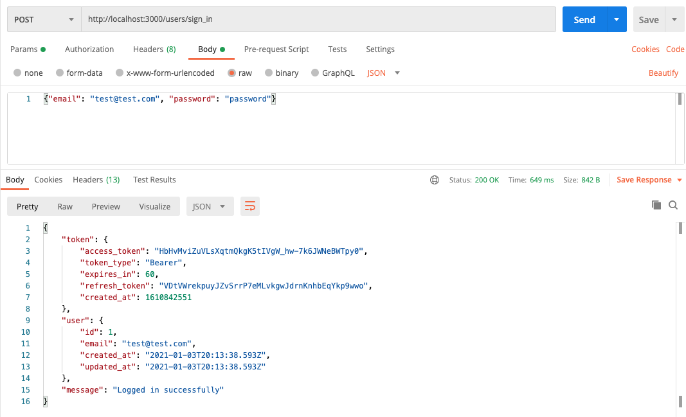

# Update All Oauth

## Getting Started 


```
rails g scaffold business name 
```

```
rails db:create
```

```
rails db:migrate
```

```
bundle add devise
```


```
rails g devise:install
```

```
# config/environments/development.rb
config.action_mailer.default_url_options = { host: 'localhost', port: 3000 }
```

```
rails g devise User
```

```
rails db:migrate
```

Add

```
before_action :authenticate_user!
```

to 
BusinessesController

```
bundle add doorkeeper
```

```
rails g doorkeeper:install
```

This will print out
```
There is a setup that you need to do before you can use doorkeeper.

Step 1.
Go to config/initializers/doorkeeper.rb and configure
resource_owner_authenticator block.

Step 2.
Choose the ORM:

If you want to use ActiveRecord run:

  rails generate doorkeeper:migration

And run

  rake db:migrate

Step 3.
That's it, that's all. Enjoy!

===============================================================================
```

We're going to come back to the initializer a bit later, for now run migration

```
rails generate doorkeeper:migration
```

Edit migration so it looks like this:

```rb
# frozen_string_literal: true

class CreateDoorkeeperTables < ActiveRecord::Migration[6.0]
  def change
    create_table :oauth_applications do |t|
      t.string  :name,    null: false
      t.string  :uid,     null: false
      t.string  :secret,  null: false

      # Remove `null: false` if you are planning to use grant flows
      # that doesn't require redirect URI to be used during authorization
      # like Client Credentials flow or Resource Owner Password.
      t.text    :redirect_uri
      t.string  :scopes,       null: false, default: ''
      t.boolean :confidential, null: false, default: true
      t.timestamps             null: false
    end

    add_index :oauth_applications, :uid, unique: true

    create_table :oauth_access_tokens do |t|
      t.references :resource_owner, index: true

      # Remove `null: false` if you are planning to use Password
      # Credentials Grant flow that doesn't require an application.
      t.references :application,    null: false

      t.string :token, null: false

      t.string   :refresh_token
      t.integer  :expires_in
      t.datetime :revoked_at
      t.datetime :created_at, null: false
      t.string   :scopes

      # The authorization server MAY issue a new refresh token, in which case
      # *the client MUST discard the old refresh token* and replace it with the
      # new refresh token. The authorization server MAY revoke the old
      # refresh token after issuing a new refresh token to the client.
      # @see https://tools.ietf.org/html/rfc6749#section-6
      #
      # Doorkeeper implementation: if there is a `previous_refresh_token` column,
      # refresh tokens will be revoked after a related access token is used.
      # If there is no `previous_refresh_token` column, previous tokens are
      # revoked as soon as a new access token is created.
      #
      # Comment out this line if you want refresh tokens to be instantly
      # revoked after use.
      t.string   :previous_refresh_token, null: false, default: ""
    end

    add_index :oauth_access_tokens, :token, unique: true
    add_index :oauth_access_tokens, :refresh_token, unique: true
    add_foreign_key(
      :oauth_access_tokens,
      :oauth_applications,
      column: :application_id
    )
  end
end

```

```
rails db:migrate
```

Comment out resource_owner_authenticator in config/initializers/doorkeeper.rb and add this:

```rb
 resource_owner_from_credentials do |_routes|
    User.authenticate(params[:email], params[:password])
  end
```

Add the authenticate method to User

```rb
validates :email, format: URI::MailTo::EMAIL_REGEXP
  
  # the authenticate method from devise documentation
  def self.authenticate(email, password)
    user = User.find_for_authentication(email: email)
    user&.valid_password?(password) ? user : nil
  end
```

Add password grant to doorkeeper config

```
# enable password grant
grant_flows %w[password]
```

Then add

```
allow_blank_redirect_uri true
```

Then add 

```
skip_authorization do
  true
end
```

And add

```
use_refresh_token
```

Add some routes:

```
use_doorkeeper do
  skip_controllers :authorizations, :applications, :authorized_applications
end
```

This is [where we're at in the tutorial](https://rubyyagi.com/rails-api-authentication-devise-doorkeeper/#create-your-own-oauth-application)

Make a new Oauth client in rails console

```
Doorkeeper::Application.create(name: "React client", redirect_uri: "", scopes: "")
```

Store the uid and secret so we can use later. 

```
bundle add dotenv-rails
touch .env
echo ".env" >> .gitignore
```

In .env 

```
REACT_CLIENT_UID=secret_here
REACT_CLIENT_SECRET=secret_here
```

We create a seeds file that will create
```rb
# db/seeds.rb
if Doorkeeper::Application.count.zero?
  Doorkeeper::Application.create(name: "iOS client", redirect_uri: "", scopes: "")
  Doorkeeper::Application.create(name: "Android client", redirect_uri: "", scopes: "")
  Doorkeeper::Application.create(name: "React client", redirect_uri: "", scopes: "")
end
```

Create a user from the rails console:

```
User.create(email:'test@test.com', password: 'password')
```

Now we can try out an endpoint in Postman. In particular, we're going to send a `POST` request to the `oauth/token` endpoint with query parameters including the `client_id`, `client_secret`, `grant_type` of password, and the `email` and `password` for credentials. In response we should get an access and refresh token:


In order to be able to safely send this request, we need to do it from our server, not the client. So, to allow for this, let's generate the devise controllers and override the login action.

```bash
rails g devise:controllers users
```

Then in `config/routes.rb`

```rb
devise_for :users, controllers: {
  sessions: 'users/sessions',
  registrations: 'users/registrations'
}
```

We're going to need the ability to send a POST request to the `oauth/token` endpoint in a controller action that will accept the user's credentials. We'll do this so we can keep the client_id and client_secret for the Oauth application private in environment variables on the server side. 

To enable easily generated HTTP requests from our rails server, let's install the faraday gem:

```bash
bundle add faraday
```

```rb
gem "faraday", "~> 1.3"
```

Since we're going to be generating OAuth tokens in more scenarios than just `sessions#create`, we'll create a `TokenService` class that will handle making the request necessary to generate a new token. Later on, we'll also add methods to this service for retrieving a new access token using a refresh token and revoking access tokens to handle logout.

```ruby
# app/services/token_service.rb
class TokenService
  def initialize(api_url)
    @api_url = api_url
  end
  def get_token(credentials)
    email = credentials[:email]
    password = credentials[:password]
    res = Faraday.post("#{@api_url}/oauth/token", {
      grant_type: 'password',
      email: email,
      password: password,
      client_id: ENV["REACT_CLIENT_UID"],
      client_secret: ENV["REACT_CLIENT_SECRET"]
    })
    JSON.parse(res.body)
  end
end
```

Finally, we need to make some changes to the `Users::SessionsController` created when we generated the Devise controllers:
1. add `respond_to :json` to the top, so we can accept fetch requests and get a json response.
2. add `skip_before_action :doorkeeper_authorize!` so that we're allowed to send this request without an access token.
3. Define a protected `sign_in` method to override the one that Devise will call after invoking `warden.authenticate!`. This means that `sign_in` will only be invoked after receiving correct credentials. This method will use the `sign_in_params` to request a new OAuth token and store it in `@token`.
4. Define a protected `respond_with` method to override the one that Devise will call to generate the response to `sessions#create`. In this method, we'll check to see if the `resource` (our user) is persisted, and respond with the user and their token if so. Otherwise, we'll respond with an error message and an `:unauthorized` status code. If `self.resource = warden.authenticate!` fails, the resource will exist with the email given in `sign_in_params`, but it won't have an `id`. Thus, `resource.persisted?` is how we're able to know, within the `respond_with` method, whether or not the authentication was successful.


```rb
# app/controllers/users/sessions_controller.rb
# frozen_string_literal: true

class Users::SessionsController < Devise::SessionsController
  # before_action :configure_sign_in_params, only: [:create]
  respond_to :json
  skip_before_action :doorkeeper_authorize!

  # GET /resource/sign_in
  # def new
  #   super
  # end

  # POST /resource/sign_in
  # def create 
  #   super
  # end 

  # DELETE /resource/sign_out
  # def destroy
  #   super
  # end

  protected

  # only called when credentials are accurate
  def sign_in(resource_name, resource)
    @token = TokenService.new(ENV['API_URL']).get_token(sign_in_params)
  end
  # called to generate response to `sessions#create`
  def respond_with(resource,_opts = {})
    if resource.persisted?
      render json: {
        user: resource,
        token: @token, 
        message: "Logged in Successfully"
      }, status: :ok
    else
      render json: {
        message: "Invalid Email or Password"
      }, status: :unauthorized
    end
  end

  # If you have extra params to permit, append them to the sanitizer.
  # def configure_sign_in_params
  #   devise_parameter_sanitizer.permit(:sign_in, keys: [:attribute])
  # end
end
```

Now, we can try this one out in postman:



I was having issues with this the first time I hit the endpoint. I was hitting a faraday timeout error. Attached are the rails server logs demonstrating the problem:

```ruby
tarted POST "/users/sign_in" for ::1 at 2021-01-17 10:41:57 -0800
Processing by Users::SessionsController#create as */*
  Parameters: {"user"=>{"email"=>"test5@test.com", "password"=>"[FILTERED]"}, "session"=>{"user"=>{"email"=>"test5@test.com", "password"=>"[FILTERED]"}}}
  User Load (1.0ms)  SELECT "users".* FROM "users" WHERE "users"."email" = $1 ORDER BY "users"."id" ASC LIMIT $2  [["email", "test5@test.com"], ["LIMIT", 1]]
Started POST "/oauth/token" for ::1 at 2021-01-17 10:41:58 -0800
Completed 500 Internal Server Error in 60302ms (ActiveRecord: 7.5ms | Allocations: 6231)


  
Faraday::TimeoutError (Net::ReadTimeout with #<TCPSocket:(closed)>):
  
app/services/token_service.rb:8:in `get_token'
app/controllers/users/sessions_controller.rb:27:in `sign_in'
Processing by Doorkeeper::TokensController#create as */*
  Parameters: {"client_id"=>"Whzs8PZa1Y2Ta0UjGIerkGkjiFHPm_6nD2bUotJ6T_w", "client_secret"=>"[FILTERED]", "email"=>"test5@test.com", "grant_type"=>"password", "password"=>"[FILTERED]"}
  Doorkeeper::Application Load (1.3ms)  SELECT "oauth_applications".* FROM "oauth_applications" WHERE "oauth_applications"."uid" = $1 LIMIT $2  [["uid", "Whzs8PZa1Y2Ta0UjGIerkGkjiFHPm_6nD2bUotJ6T_w"], ["LIMIT", 1]]
  User Load (1.1ms)  SELECT "users".* FROM "users" WHERE "users"."email" = $1 ORDER BY "users"."id" ASC LIMIT $2  [["email", "test5@test.com"], ["LIMIT", 1]]
  ↳ app/models/user.rb:12:in `authenticate'
  TRANSACTION (0.3ms)  BEGIN
  Doorkeeper::Application Load (0.4ms)  SELECT "oauth_applications".* FROM "oauth_applications" WHERE "oauth_applications"."id" = $1 LIMIT $2  [["id", 1], ["LIMIT", 1]]
  Doorkeeper::AccessToken Exists? (0.4ms)  SELECT 1 AS one FROM "oauth_access_tokens" WHERE "oauth_access_tokens"."token" = $1 LIMIT $2  [["token", "4Z9vqCmbxLzFBMFjgZSRQRAkIl-7BarA0_VoqZ_JZFQ"], ["LIMIT", 1]]
  Doorkeeper::AccessToken Exists? (0.6ms)  SELECT 1 AS one FROM "oauth_access_tokens" WHERE "oauth_access_tokens"."refresh_token" = $1 LIMIT $2  [["refresh_token", "AR4DOJ0vnjihQBcca-YbIMiMAnBKJPY6smGxCPaZpqE"], ["LIMIT", 1]]
  Doorkeeper::AccessToken Create (0.6ms)  INSERT INTO "oauth_access_tokens" ("resource_owner_id", "application_id", "token", "refresh_token", "expires_in", "created_at", "scopes") VALUES ($1, $2, $3, $4, $5, $6, $7) RETURNING "id"  [["resource_owner_id", 9], ["application_id", 1], ["token", "4Z9vqCmbxLzFBMFjgZSRQRAkIl-7BarA0_VoqZ_JZFQ"], ["refresh_token", "AR4DOJ0vnjihQBcca-YbIMiMAnBKJPY6smGxCPaZpqE"], ["expires_in", 60], ["created_at", "2021-01-17 18:42:58.743862"], ["scopes", ""]]
  TRANSACTION (2.2ms)  COMMIT
Completed 200 OK in 394ms (Views: 0.3ms | ActiveRecord: 15.9ms | Allocations: 10919)
```

After reading a [stackoverflow thread about the issue](https://stackoverflow.com/questions/11857182/faraday-timeout-error-with-omniauth-custom-strategy-doorkeeper), I looked into doing the recommended solution, but it didn't work for me. Maybe an issue with Rails 6?  After reading one of the comments in that thread, I made another google and found [Issues with making requests from one endpoint to another](https://softwareengineering.stackexchange.com/questions/345406/is-it-bad-design-to-internally-call-api-endpoints-from-within-the-api-instance). In any event, it seemed like there had to be a better way. In actual fact, the tutorial I was following had a recommendation later on in a piece I hadn't gotten to yet 🤦‍♂️

```ruby
module Api
  class UsersController < Api::ApplicationController
    skip_before_action :doorkeeper_authorize!, only: %i[create]

    def create
      user = User.new(email: user_params[:email], password: user_params[:password])

      client_app = Doorkeeper::Application.find_by(uid: params[:client_id])

      return render(json: { error: 'Invalid client ID'}, status: 403) unless client_app

      if user.save
        # create access token for the user, so the user won't need to login again after registration
        access_token = Doorkeeper::AccessToken.create(
          resource_owner_id: user.id,
          application_id: client_app.id,
          refresh_token: generate_refresh_token,
          expires_in: Doorkeeper.configuration.access_token_expires_in.to_i,
          scopes: ''
        )
        
        # return json containing access token and refresh token
        # so that user won't need to call login API right after registration
        render(json: {
          user: {
            id: user.id,
            email: user.email,
            access_token: access_token.token,
            token_type: 'bearer',
            expires_in: access_token.expires_in,
            refresh_token: access_token.refresh_token,
            created_at: access_token.created_at.to_time.to_i
          }
        })
      else
        render(json: { error: user.errors.full_messages }, status: 422)
      end
    end

    private

    def user_params
      params.permit(:email, :password)
    end

    def generate_refresh_token
      loop do
        # generate a random token string and return it, 
        # unless there is already another token with the same string
        token = SecureRandom.hex(32)
        break token unless Doorkeeper::AccessToken.exists?(refresh_token: token)
      end
    end 
  end
end
```

Since we're using a token service here along with devise routes, a little reworking is in order.